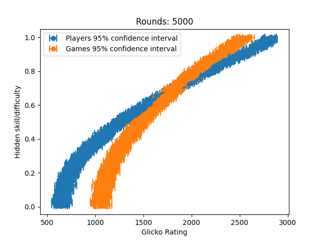

# glicko_from_scratch
implements the glicko rating system from scratch and runs a fun experiment

# glicko implementation
See glicko.py for details. 

# Experiment
I wanted to see if we could use the glicko rating system to learn a relatively sophisticated real world relationship. 

## Problem formulation: 
Suppose we had `n` players and `m` solataire style games. Each player's skill and each game's difficulty is represented by a value between 0 and 1. There exists some model `p_win(player_skill, game_difficulty)` which returns the probability that the player will win the game. We'd like learn this model by observing the outcomes of player-game interactions.

## My solution
If we initialize each player and game with a glicko rating and then update these ratings based on our observations, we should be able to recover a mapping from rating to underlying skill/difficulty.

I arbitrarily chose to have 100 players and 1000 games. I simulated 10000 "rounds" of play, where each round consists of each of the players playing a random game (so we have a total of 100 * 10000 = 1 million observations).

After 200 rounds of play, we can clearly see that we learned something! Notice that our model for games is significantly more noisy than our model for players. This makes senses, as we recieve significantly fewer observations per game compared to observations per player.

After 1000 rounds, noise is significantly reduced and we can see a pretty clear coorelation between the hidden skill and the rating for players, however noise on games is still quite high. 

After 5000 rounds we can see results very clearly!

After 10,000 rounds our results remain stable.

## Evaluating solution

