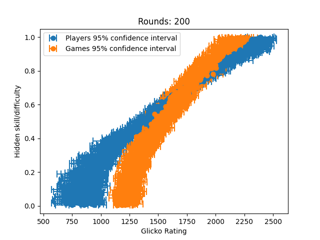
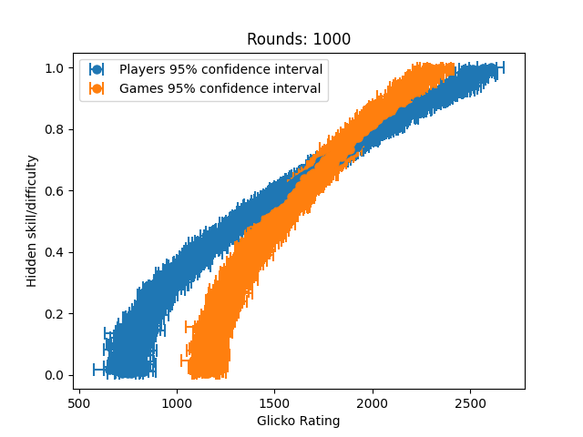
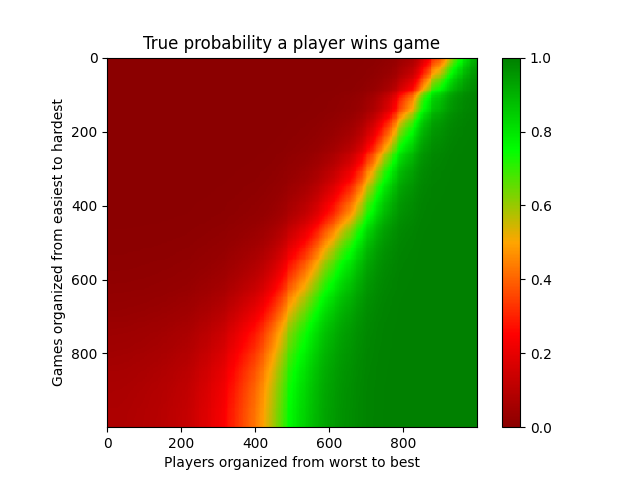
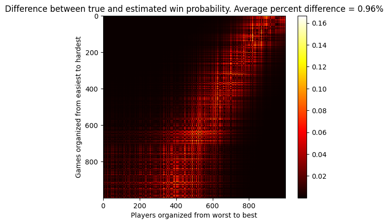

# glicko_as_ml
Implements the glicko rating system from scratch and shows how it can be used for modeling. 

# glicko implementation
See glicko.py for details. 

# Experiment
I wanted to see if we could use the glicko rating system to learn/model a relatively sophisticated real world relationship. 

## Problem formulation: 
Suppose we had `n` players and `m` solataire style games. Each player's skill and each game's difficulty is represented by a value between 0 and 1. There exists some model `p_win(player_skill, game_difficulty)` which returns the probability that the player will win the game. We'd like learn this model purely by observing the outcomes of player-game interactions.

## My solution
If we initialize each player and game with a glicko rating and then update these ratings based on our observations, we should be able to recover a mapping from rating to underlying skill/difficulty.

I arbitrarily chose to have 1000 players and 1000 games. I simulated 10000 "rounds" of play, where each round consists of each of the players playing a random game (so we have a total of 1000 * 10000 = 10 million observations).

After 200 rounds of play, we can clearly see that we learned something! There is a reasonably clear correlation between rating and the hidden skill/difficulty. 

After 1000 rounds, noise is significantly reduced. 

After 2000 rounds we can see results very clearly and the system has pretty much stabilized. 

After 10,000 rounds our results remain stable and our confidence bounds are really tight (they are artificially bounded below at 30 per Glickman's recommendation).

## Evaluating solution
Here's the ground truth `p_win` function evaluated on each pair of (player, game) in the population. I made up the ground truth `p_win` function pretty arbitrarily (it is a logistic function) you can check it out in glicko_experiment1.py if you are curious.

As a comparision here's the model we learned from our simulation. Glickman gives us a convinent way to calcuate the expected outcome of a (player, game) pair. We can see that they are pretty similar, but how similar are they?

To help answer this question we can plot the absolute value of the difference between these two matricies, which tells us how different the predicted vs ground truth value is for each (player, game) pair. You can see that most error accumulates along the 50% win probability line - maybe because these observations were inherently more noisy. We find that on average the model's prediction is within 0.96% of the true value, which is pretty suprising to me.  

